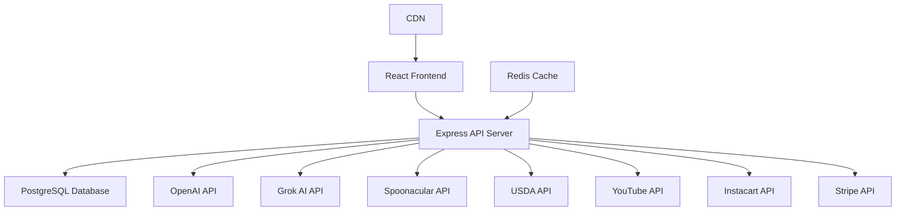

# NutriMa System Architecture

## Overview

NutriMa is a full-stack web application built with a React frontend and Node.js backend, following a microservices-inspired architecture with clear separation of concerns.

## System Components



## Frontend Architecture

### Technology Stack
- **Framework**: React 18.3.1 with TypeScript
- **Build Tool**: Vite
- **State Management**: TanStack Query + Local State
- **Routing**: Wouter
- **UI Framework**: Radix UI + Tailwind CSS
- **Forms**: React Hook Form + Zod

### Component Architecture
```
src/
├── components/          # Reusable UI components
│   ├── ui/             # Base design system components
│   └── features/       # Feature-specific components
├── pages/              # Route components
├── hooks/              # Custom React hooks
├── lib/                # Utilities and services
│   ├── api.ts         # API client
│   ├── auth.ts        # Auth utilities
│   └── utils.ts       # Helper functions
└── App.tsx            # Root component with routing
```

### State Management Strategy
1. **Server State**: TanStack Query for API data
2. **UI State**: Component-level useState/useReducer
3. **Global State**: React Context for auth/theme
4. **URL State**: Query params for shareable state

### Performance Optimizations
- Code splitting by route
- Lazy loading of heavy components
- Image optimization with responsive sizing
- React Query caching with stale-while-revalidate
- Virtual scrolling for long lists

## Backend Architecture

### Technology Stack
- **Runtime**: Node.js with TypeScript
- **Framework**: Express.js
- **Database**: PostgreSQL (Neon) with Drizzle ORM
- **Authentication**: JWT + bcrypt
- **Session Management**: Express Sessions
- **API Documentation**: TypeScript types

### Service Layer Architecture
```
server/
├── routes.ts                    # API endpoint definitions
├── auth.ts                      # Authentication middleware
├── db.ts                        # Database connection
├── services/
│   ├── mealPlanGenerator.ts    # Core business logic
│   ├── recipeService.ts        # Recipe management
│   ├── nutritionService.ts     # Nutrition calculations
│   └── shoppingService.ts      # Shopping list generation
├── integrations/
│   ├── openai.ts               # OpenAI integration
│   ├── spoonacular.ts          # Recipe API
│   ├── instacart.ts            # Shopping API
│   └── stripe.ts               # Payment processing
└── utils/
    ├── cache.ts                # Caching utilities
    ├── logger.ts               # Logging service
    └── errors.ts               # Error handling
```

### API Design Principles
- RESTful endpoints with consistent naming
- JSON request/response format
- Proper HTTP status codes
- Comprehensive error messages
- Request validation with Zod schemas

## Database Schema

### Core Tables
```sql
-- Users table
CREATE TABLE users (
    id UUID PRIMARY KEY,
    email VARCHAR(255) UNIQUE NOT NULL,
    password_hash VARCHAR(255) NOT NULL,
    profile JSONB,
    created_at TIMESTAMP DEFAULT NOW()
);

-- Meal Plans table
CREATE TABLE meal_plans (
    id UUID PRIMARY KEY,
    user_id UUID REFERENCES users(id),
    title VARCHAR(255),
    date_range JSONB,
    meals JSONB,
    created_at TIMESTAMP DEFAULT NOW()
);

-- Recipes table
CREATE TABLE recipes (
    id UUID PRIMARY KEY,
    user_id UUID REFERENCES users(id),
    title VARCHAR(255),
    ingredients JSONB,
    instructions JSONB,
    nutrition JSONB,
    created_at TIMESTAMP DEFAULT NOW()
);

-- User Preferences table
CREATE TABLE user_preferences (
    user_id UUID PRIMARY KEY REFERENCES users(id),
    dietary_restrictions JSONB,
    cultural_preferences JSONB,
    goals JSONB,
    updated_at TIMESTAMP DEFAULT NOW()
);
```

### Database Design Decisions
- JSONB for flexible, nested data structures
- UUID primary keys for distributed systems
- Soft deletes with deleted_at timestamps
- Indexes on frequently queried columns

## AI Integration Architecture

### Multi-Provider Strategy
```typescript
interface AIProvider {
  generateMealPlan(prompt: string): Promise<MealPlan>;
  generateRecipe(prompt: string): Promise<Recipe>;
}

class OpenAIProvider implements AIProvider { /* ... */ }
class GrokProvider implements AIProvider { /* ... */ }

class AIService {
  providers: AIProvider[] = [
    new OpenAIProvider(),
    new GrokProvider()
  ];
  
  async generate(prompt: string): Promise<Result> {
    for (const provider of this.providers) {
      try {
        return await provider.generate(prompt);
      } catch (error) {
        continue; // Try next provider
      }
    }
    throw new Error('All providers failed');
  }
}
```

### Prompt Engineering Pipeline
1. **User Input Analysis**: Parse preferences and constraints
2. **Context Building**: Add cuisine, dietary, and goal context
3. **Prompt Template**: Structure for optimal AI response
4. **Response Parsing**: Extract structured data from AI output
5. **Validation**: Ensure response meets requirements

## External API Integrations

### Spoonacular (Recipes)
- Recipe search and discovery
- Nutrition information
- Ingredient substitutions
- Rate limit: 150 requests/day

### USDA FoodData Central
- Authoritative nutrition data
- Food composition details
- Serving size information
- Rate limit: 1000 requests/hour

### YouTube Data API
- Recipe video search
- Video metadata extraction
- Transcript access (when available)
- Quota: 10,000 units/day

### Instacart Partner API
- Product catalog search
- Shopping list creation
- Availability checking
- Real-time pricing

## Security Architecture

### Authentication Flow
```
1. User Login
   └─> Validate credentials
   └─> Generate JWT token
   └─> Create session
   └─> Return token + user data

2. Authenticated Request
   └─> Extract JWT from header
   └─> Verify token signature
   └─> Check token expiration
   └─> Load user context
   └─> Process request

3. Token Refresh
   └─> Check refresh token
   └─> Validate user status
   └─> Issue new JWT
   └─> Update session
```

### Security Measures
- Password hashing with bcrypt (10 rounds)
- JWT tokens with short expiration (15 min)
- Refresh tokens with longer expiration (7 days)
- HTTPS enforcement in production
- CORS configuration for frontend origin
- Rate limiting per user and IP
- Input sanitization and validation
- SQL injection prevention with Drizzle ORM

## Caching Strategy

### Cache Layers
1. **Browser Cache**: Static assets with long TTL
2. **React Query Cache**: API responses (5 min default)
3. **Server Memory Cache**: Frequent queries (10 min)
4. **Redis Cache**: Session data and meal plans
5. **CDN Cache**: Images and static files

### Cache Invalidation
- User-specific data: On update/delete
- Meal plans: After 24 hours
- Recipe data: After 7 days
- Nutrition data: Never (static)

## Deployment Architecture

### Production Environment
```
┌─────────────────┐
│   Cloudflare    │  <-- CDN & DDoS Protection
└────────┬────────┘
         │
┌────────▼────────┐
│   Vercel Edge   │  <-- Frontend Hosting
└────────┬────────┘
         │
┌────────▼────────┐
│  Load Balancer  │
└────────┬────────┘
         │
┌────────▼────────┐
│ Express Servers │  <-- Multiple instances
└────────┬────────┘
         │
    ┌────┴────┐
    │         │
┌───▼──┐  ┌──▼───┐
│ Neon  │  │Redis │
│  DB   │  │Cache │
└───────┘  └──────┘
```

### Scaling Strategy
- Horizontal scaling for API servers
- Database read replicas for queries
- Redis cluster for caching
- CDN for global asset delivery
- Auto-scaling based on CPU/memory

## Performance Considerations

### Frontend Performance
- Initial bundle: < 1MB target
- Time to Interactive: < 3s
- Lighthouse score: > 90
- Core Web Vitals: All green

### Backend Performance
- API response time: < 200ms avg
- Meal plan generation: < 5s
- Database queries: < 50ms
- Concurrent users: 10,000+

### Optimization Techniques
- Database query optimization
- Efficient data structures
- Parallel API calls
- Response streaming
- Connection pooling

## Monitoring and Observability

### Metrics Collection
- Application Performance Monitoring (APM)
- Error tracking and alerting
- User behavior analytics
- Business metrics dashboards

### Logging Strategy
```typescript
// Structured logging format
logger.info('Meal plan generated', {
  userId: user.id,
  duration: endTime - startTime,
  recipeCount: recipes.length,
  provider: 'openai'
});
```

### Health Checks
- `/health` - Basic server health
- `/health/db` - Database connectivity
- `/health/redis` - Cache availability
- `/health/external` - External API status

## Development Workflow

### Local Development
```bash
# Frontend (Port 5173)
npm run dev

# Backend (Port 5000)
npm run dev:server

# Database
docker-compose up postgres
```

### Testing Strategy
- Unit tests for business logic
- Integration tests for APIs
- E2E tests for critical flows
- Performance tests for load

### CI/CD Pipeline
1. Code push to GitHub
2. Run linting and type checks
3. Execute test suite
4. Build Docker images
5. Deploy to staging
6. Run E2E tests
7. Deploy to production
8. Monitor metrics

## Future Architecture Considerations

### Microservices Migration
- Extract meal planning service
- Separate recipe service
- Independent nutrition service
- API Gateway pattern

### Event-Driven Architecture
- Meal plan generation events
- Recipe creation events
- User activity events
- Real-time notifications

### Machine Learning Pipeline
- User preference learning
- Recipe recommendation engine
- Nutrition optimization ML
- Cost prediction models

---

*This architecture document is updated as the system evolves. Last update: January 2025*